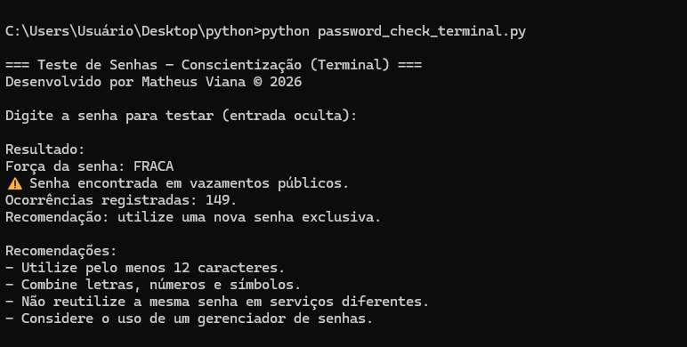

# Como usar
Este documento descreve como executar as versões disponíveis do laboratório de forma correta, tanto no modo **console (terminal)** quanto no modo **interface gráfica (GUI)**.

## Requisitos gerais
- Python 3 instalado no sistema  
- Conexão com a internet **apenas** para a verificação de vazamentos  

> Observação:
> O Python já vem com a biblioteca gráfica necessária (Tkinter) instalada por padrão na maioria dos sistemas Windows e Linux.

## Dependências
A biblioteca abaixo é necessária **para ambas as versões** (console e interface gráfica):
- requests

Instalação da dependência:
```
pip install requests
````
## Demonstração de uso
Abaixo estão exemplos de execução das versões disponíveis do laboratório.  
Ambas as versões foram testadas utilizando a mesma senha: **Tryhackme**.

### Execução no terminal
Exemplo de uso da aplicação em ambiente de linha de comando, exibindo a avaliação da força da senha e a verificação de exposição em vazamentos públicos.



### Execução alternativa no console
Execução da aplicação em modo console utilizando a mesma senha, permitindo comparar o comportamento entre as versões disponíveis.


